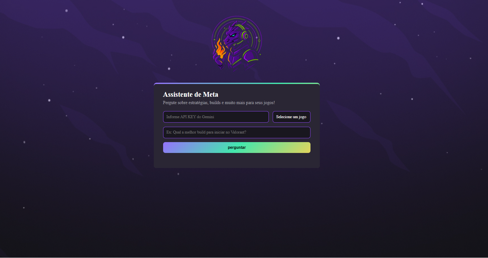

# 🎮 Assistente de Meta

Um assistente IA especializado em estratégias, builds e meta de jogos populares.

## 📸 Demonstração

## 🎯 Funcionalidades

- **Suporte a múltiplos jogos**: Valorant, Minecraft e League of Legends
- **Respostas inteligentes**: Usa API Gemini para gerar estratégias e builds
- **Respostas rápidas**: Máximo 500 caracteres, direto ao ponto
- **Interface amigável**: Design moderno em tema escuro

## 🚀 Como usar

1. Obtenha sua [API Key do Gemini](https://ai.google.dev)
2. Cole a API Key no campo de entrada
3. Selecione um jogo
4. Faça sua pergunta
5. Clique em "Perguntar"

## 🛠️ Tecnologias

- HTML5 / CSS3
- JavaScript (Vanilla
